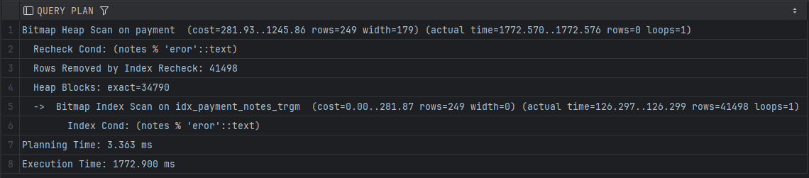
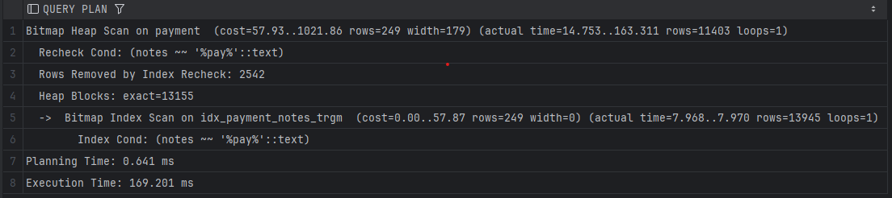

# Отчет по лабораторной работе №1 
# По курсу "Базы Данных"

### Выполнил: Концебалов Олег Сергеевич
### Группа: М8О-309Б-22

---

Для выполнения лабораторной работы я решил выбрать предметную область банка, а именно таблицы платежей.

Структура таблицы имеет следующий вид


Общее число записей в таблице: 5000000

Инициализация базы данных происходит с помощью [init.sql](./sql/init.sql)

База данных поднимается в docker контейнере c помощью [docker-compose.yml](./docker-compose.yml)

Для генерации тестовых данных я написал [python-скрипт](./scripts/generate_data.py), который 
подключается к базе данных и заполняет ее синтетическими данными

---

## Часть 1

***Цель работы:*** Изучить различные типы индексов в PostgreSQL и их применение для
ускорения выполнения запросов в различных предметных областях

Теперь будем выполнять различные SQL-запросы к базе данных и смотреть на время их выполнения,
а так же с помощью `EXPLAIN ANALYZE` посмотрим на работу планировщика запросов

```sql
EXPLAIN ANALYZE
SELECT *
FROM payment
WHERE booking_id = 1234;
```


Видим время выполнения 1263 ms. Попробуем ускорить этот запрос путем добавления 
индекса `B-Tree`

```sql
CREATE INDEX idx_payment_booking_id ON payment(booking_id); 
```

Выполняем тот же запрос и получаем:


Получили время работы 11,5 ms - Ускорение более чем в 100 раз

Усложним задачу - попробуем выполнить поиск по тексту

```sql
EXPLAIN ANALYZE 
SELECT * 
FROM payment 
WHERE to_tsvector('english', notes) @@ 
plainto_tsquery('english', 'error');
```


Время выполнения 45 секунд! Это непозволительно долго для реального продакшн приложения.
Поиск по тексту может использоваться в разных областях, например, мониторинг логов
при траблшутинге во время сбоя - в такие моменты каждая секунда на счету и ждать 45 секунд
для выполнения простого запроса - непозволительно долго

Повесим индекс для ускорения поиска. Так как мы работаем с 
векторами, то идеальнее всего подходит `GIN`.

```sql
CREATE INDEX idx_payment_notes_gin ON payment USING GIN (to_tsvector('english', notes));
```

Создание такого индекса достаточно долгая операция, блокирующая всю таблицу. 
В моем случае это 204 s. Но результат полностью окупает потраченное время

Выполним повторно SQL запрос и посмотрим на время выполнения


Время выполнения - 0.278 ms. Ускорение более чем в 100 тысяч раз!

Теперь посмотрим на `BRIN` индекс: он хорошо работает для 
данных, которые идут в хронологическом порядке. Так как 
мои данные генерировались фейкером, то вероятнее всего 
BRIN индекс не позволит кардинально улучшить скорость 
работы запроса. 

Выполним запрос

```sql
EXPLAIN ANALYZE 
SELECT * 
FROM payment 
WHERE payment_time BETWEEN '2025-01-01' AND '2025-04-02'; 
```


Время выполнения 6 s. Попробуем ускорить с помощью `BRIN` индекса.
Создадим его с помощью команды

```sql
CREATE INDEX idx_payment_payment_time_brin ON payment USING BRIN (payment_time); 
```

Снова выполним SQL запрос и посмотрим на время выполнения


Получили все те же 6 s времени выполнения

**Выводы:**
- Применение индексов значительно ускоряет время работы запросов, но только для не слишком больших диапазонов значений
- `B-Tree` индекс ускорил время работы в 100 раз
- `GIN` индекс показал какие-то космические результаты - ускорение более чем в 100 тысяч раз (в 160 тысяч раз)
- `BRIN` индекс не дал никакого буста к скорости из-за особенностей моего датасета

---

## Часть 2

**Цель работы:** Изучить работу с транзакциями в PostgreSQL, их применение для
 обеспечения целостности данных и управления параллельными операциями

Существуют различные виды изоляции транзакций:
- READ UNCOMMITTED
- READ COMMITTED
- REPEATABLE READ
- SERIALIZABLE

Для демонстрации работы транзакций и различных аномалий я написал скрипт [transaction_demo.go](./transactions_demo.go) на языке Golang

### NonRepeatable Read

Non-Repeatable Read (NRR) - это ситуация, когда в рамках одной транзакции повторное чтение одних и тех же данных возвращает разные значения, потому что другая транзакция изменила эти данные и закоммитила изменения.

1) Транзакция A читает строку

2) Транзакция B изменяет эту строку и коммитит изменения

3) Транзакция A снова читает ту же строку и видит измененные данные

```
[NRR #1] Начало демонстрации неповторяемого чтения
[NRR #2] Начало демонстрации неповторяемого чтения
[NRR #4] Начало демонстрации неповторяемого чтения
[NRR #3] Начало демонстрации неповторяемого чтения
2025/04/25 00:08:31 [NRR #1] TxA первый SELECT: amount = 390.66
2025/04/25 00:08:31 [NRR #3] TxA первый SELECT: amount = 390.66
2025/04/25 00:08:31 [NRR #4] TxA первый SELECT: amount = 390.66
2025/04/25 00:08:31 [NRR #2] TxA первый SELECT: amount = 390.66
2025/04/25 00:08:31 [NRR #1] TxB обновил payment_id = 1
2025/04/25 00:08:31 [NRR #4] TxB обновил payment_id = 1
2025/04/25 00:08:31 [NRR #3] TxB обновил payment_id = 1
2025/04/25 00:08:31 [NRR #2] TxB обновил payment_id = 1
2025/04/25 00:08:33 [NRR #1] TxA второй SELECT: amount = 590.66
[NRR #1] Завершена демонстрация неповторяемого чтения
2025/04/25 00:08:33 [NRR #3] TxA второй SELECT: amount = 590.66
2025/04/25 00:08:33 [NRR #4] TxA второй SELECT: amount = 590.66
[NRR #3] Завершена демонстрация неповторяемого чтения
2025/04/25 00:08:33 [NRR #2] TxA второй SELECT: amount = 590.66
[NRR #4] Завершена демонстрация неповторяемого чтения
[NRR #2] Завершена демонстрация неповторяемого чтения
Все демонстрационные горутины завершены.
```

Запустил 4 параллельные транзакции, которые работают с одной записью. Каждая из `TxA` делает два `SELECT`,
а `TxB` увеличивает значение `amount` на 50

- TxA читает данные дважды.

- TxB меняет данные между этими чтениями и коммитит изменения.

- TxA видит новые данные при втором SELECT.

PostgreSQL по умолчанию использует `READ COMMITTED`. Транзакция видит только закоммиченные изменения других транзакций.
Нет гарантии, что повторный `SELECT` вернёт те же данные

### Repeatable Read

Repeatable Read (RR) - это гарантия, что в рамках одной транзакции многократное чтение одних и тех же данных будет возвращать одинаковые значения, даже если другие транзакции изменяют эти данные.

1) PostgreSQL создает снимок данных (snapshot) на момент начала транзакции

2) Все последующие чтения в этой транзакции видят данные на момент создания снимка

3) Защищает от Non-Repeatable Read

```
[RR #4] Начало демонстрации повторяемого чтения
[RR #3] Начало демонстрации повторяемого чтения
[RR #2] Начало демонстрации повторяемого чтения
[RR #1] Начало демонстрации повторяемого чтения
2025/04/25 00:15:36 [RR #4] TxA первый SELECT: amount = 640.66
2025/04/25 00:15:36 [RR #3] TxA первый SELECT: amount = 640.66
2025/04/25 00:15:36 [RR #1] TxA первый SELECT: amount = 640.66
2025/04/25 00:15:36 [RR #2] TxA первый SELECT: amount = 640.66
2025/04/25 00:15:37 [RR #4] TxB обновил payment_id = 1
2025/04/25 00:15:37 [RR #3] TxB Update: pq: could not serialize access due to concurrent update
2025/04/25 00:15:37 [RR #2] TxB Update: pq: could not serialize access due to concurrent update
2025/04/25 00:15:37 [RR #1] TxB Update: pq: could not serialize access due to concurrent update
2025/04/25 00:15:38 [RR #4] TxA второй SELECT: amount = 640.66
[RR #4] Завершена демонстрация повторяемого чтения
2025/04/25 00:15:38 [RR #3] TxA второй SELECT: amount = 640.66
[RR #3] Завершена демонстрация повторяемого чтения
2025/04/25 00:15:38 [RR #1] TxA второй SELECT: amount = 640.66
[RR #1] Завершена демонстрация повторяемого чтения
2025/04/25 00:15:38 [RR #2] TxA второй SELECT: amount = 640.66
[RR #2] Завершена демонстрация повторяемого чтения
Все демонстрационные горутины завершены.
```

Запустил 4 параллельные транзакции, работающие с одной записью. Каждая `TxA` делает два `SELECT`
и видит одно и то же значение `amount`, несмотря на попытки обновления

- Только RR #4 успешно выполнила `UPDATE`

- Остальные (RR #1, RR #2, RR #3) получили ошибку:

```
pq: could not serialize access due to concurrent update
```

Уровень изоляции `REPEATABLE READ` гарантирует, что в рамках одной транзакции повторные чтения возвращают одинаковые данные (снимок на момент начала транзакции).

Защищает от Non-Repeatable Read, но не всегда от Phantom Read. 

PostgreSQL использует механизм блокировок для защиты целостности данных.

- Первая TxB (RR #4) захватила строку на UPDATE.

- стальные TxB получили ошибку, потому что:

- - REPEATABLE READ в PostgreSQL не допускает параллельные изменения одной строки.

- - Это предотвращает потерю обновлений (lost update).

В REPEATABLE READ каждая транзакция работает с снимком данных (snapshot) на момент своего начала.
Даже если RR #4 обновила данные, другие транзакции не видят эти изменения до коммита.

### Phantom Read

Phantom Read - это ситуация, когда в рамках одной транзакции повторное выполнение запроса с одинаковыми условиями возвращает разный набор строк из-за того, что другая транзакция добавила или удалила строки, удовлетворяющие условиям.

1) Транзакция A выполняет запрос с условием WHERE

2) Транзакция B добавляет/удаляет строки, удовлетворяющие этому условию

3) Транзакция A повторяет запрос и видит другой набор строк

```
[PR #1] Начало демонстрации фантомного чтения
[PR #2] Начало демонстрации фантомного чтения
[PR #3] Начало демонстрации фантомного чтения
2025/04/03 21:21:29 [PR #1] TxA COUNT1: 2527517 строк с amount > 500.00 
2025/04/03 21:21:29 [PR #3] TxA COUNT1: 2527517 строк с amount > 500.00 
2025/04/03 21:21:29 [PR #2] TxA COUNT1: 2527517 строк с amount > 500.00 
2025/04/03 21:21:29 [PR #4] TxA COUNT1: 2527517 строк с amount > 500.00 
2025/04/03 21:21:29 [PR #4] TxB вставил новую запись с amount = 600.00 
2025/04/03 21:21:29 [PR #2] TxB вставил новую запись с amount = 600.00 
2025/04/03 21:21:29 [PR #3] TxB вставил новую запись с amount = 600.00 
2025/04/03 21:21:29 [PR #1] TxB вставил новую запись с amount = 600.00 
2025/04/03 21:21:31 [PR #2] TxA COUNT2: 2527521 строк с amount > 500.00 
[PR #2] Завершено 
2025/04/03 21:21:31 [PR #3] TxA COUNT2: 2527521 строк с amount > 500.00 
2025/04/03 21:21:31 [PR #1] TxA COUNT2: 2527521 строк с amount > 500.00 
[PR #3] Завершено 
[PR #1] Завершено 
2025/04/03 21:21:31 [PR #4] TxA COUNT2: 2527521 строк с amount > 500.00 
```

4 параллельные транзакции (PR #1–#4) работают с таблицей payment:

- `TxA` делает два запроса `COUNT(*)` для строк с amount > 500.00.

- `TxB` вставляет новые строки с amount = 600.00.

Результаты:

- Первый `COUNT`: Все `TxA` видят одинаковое значение — 2,527,517 строк.

- Вставки: Каждая `TxB` добавила по одной строке (итого +4 строки).

- Второй `COUNT`: Все `TxA` видят 2,527,521 строк (+4 к первоначальному значению).

Итог: Транзакции `TxA` обнаружили новые строки, которых не было при первом чтении.

Уровень изоляции READ COMMITTED разрешает фантомное чтение. Транзакция видит новые строки, добавленные другими транзакциями после первого запроса.


Механизм Phantom Read 
- TxA считает строки → TxB добавляет новые → TxA снова считает и видит изменения.

В отличие от Non-Repeatable Read (изменение существующих строк), здесь появляются новые строки.

### Serialization Failure

Serialization Failure возникает, когда система не может гарантировать последовательное выполнение параллельных транзакций без конфликтов. PostgreSQL откатывает одну из транзакций с соответствующей ошибкой.

1) При уровне изоляции SERIALIZABLE

2) Когда две транзакции читают одни данные, затем пытаются их изменить

3) Когда возможна потеря обновлений (lost update)

```
[SF #3] Начало демонстрации ошибок сериализации
[SF #2] Начало демонстрации ошибок сериализации
[SF #1] Начало демонстрации ошибок сериализации
2025/04/25 00:18:19 [SF #3] TxA прочитал amount = 690.66
2025/04/25 00:18:19 [SF #2] TxA прочитал amount = 690.66
2025/04/25 00:18:19 [SF #3] TxB прочитал amount = 690.66
2025/04/25 00:18:19 [SF #1] TxB прочитал amount = 690.66
2025/04/25 00:18:19 [SF #2] TxB прочитал amount = 690.66
2025/04/25 00:18:20 [SF #3] TxB успешно закоммитилась
2025/04/25 00:18:20 [SF #1] TxB UPDATE: pq: could not serialize access due to concurrent update
2025/04/25 00:18:20 [SF #2] TxB UPDATE: pq: could not serialize access due to concurrent update
2025/04/25 00:18:21 [SF #3] TxA UPDATE: pq: could not serialize access due to concurrent update
[SF #3] Завершена демонстрация ошибок сериализации
2025/04/25 00:18:21 [SF #1] TxA UPDATE: pq: could not serialize access due to concurrent update
2025/04/25 00:18:21 [SF #2] TxA UPDATE: pq: could not serialize access due to concurrent update
[SF #1] Завершена демонстрация ошибок сериализации
[SF #2] Завершена демонстрация ошибок сериализации
```

3 параллельные транзакции (SF #1–#3) работают с одной записью

Уровень изоляции `SERIALIZABLE` - Самый строгий уровень в PostgreSQL.

Гарантирует, что параллельные транзакции ведут себя так, будто выполняются последовательно.

Механизм защиты: Если система обнаруживает конфликт (например, две транзакции читают одни данные, затем пытаются их изменить), одна из них откатывается с ошибкой сериализации.

Причина ошибок
- Все транзакции сначала прочитали amount = 690.66.

- SF #3 TxB первой успела выполнить UPDATE и закоммитить изменения.

- Остальные транзакции при попытке изменить те же данные получили ошибку, потому что:
  PostgreSQL не может гарантировать их последовательное выполнение без конфликтов.
  Это предотвращает аномалии сериализации (например, "потерянные обновления").


Почему SF #3 TxA тоже не сработала? Даже если SF #3 TxB (из той же пары) успела обновить данные, SF #3 TxA уже прочитала старые данные до этого.
Её попытка изменить данные конфликтует с другими транзакциями.

`SERIALIZABLE` жертвует производительностью ради строгой согласованности.

---

## Часть 3

**Цель работы:** Изучить использование расширений PostgreSQL: pg_bigm, pg_trgm и
 pgcrypto для решения реальных задач по поиску и безопасности данных

Расширения я установил вместе с инициализацией базы данных 

```sql
-- Устанавливаем расширения
CREATE EXTENSION IF NOT EXISTS pg_trgm;
CREATE EXTENSION IF NOT EXISTS pg_bigm;
CREATE EXTENSION IF NOT EXISTS pgcrypto;
```

В таблице `payment` есть поле `notes`. Предположим, что бизнес поставил нам задачу
реализовать поиск по этому полю с учетом опечаток и фрагментного совпадения, причем этот поиск
должен быть эффективным, для автоматизации аналитики

Для решения такой задачи можно использовать индекс:

- для `pg_trgm`

```sql
CREATE INDEX idx_payment_notes_trgm ON payment USING gin (notes gin_trgm_ops); 
```

Создание индекса заняло 2 m 33 s 

- для `pg_bigm` (более актуально для языков без разделителей, таких как японский или китайский, но также помогает при работе с длинными строками)

```sql
CREATE INDEX idx_payment_notes_bigm ON payment USING gin (notes gin_bigm_ops);
```

Создание индекса заняло 2 m 53 s

Теперь выполним запросы с использованием оператора похожести и поиска подстроки

```sql
EXPLAIN ANALYZE 
SELECT *
FROM payment 
WHERE notes % 'proces';
```

Нашли 276 строк, в которых содержится слово похожее на `proces` (process)




```sql
EXPLAIN ANALYZE
SELECT *
FROM payment
WHERE notes LIKE '%process%';
```

За 0.5 s нашли 11846 строк, в которых содержится слово `process`



### Pgcrypto

pgcrypto позволяет выполнять шифрование и хэширование. 
Пример использования для защиты чувствительных данных, 
например, хранения хэша пароля или шифрования номера 
карты

```sql
UPDATE payment
SET card_number = pgp_sym_encrypt('4111111111111111', 'secret_key')
WHERE payment_id = 1;
```

Добавим зашифрованный номер карты в таблицу

Теперь сделаем запрос к базе и посмотрим, что у нас там лежит

```sql
SELECT payment_id, card_number
FROM payment
WHERE payment_id = 1
```


Расшифруем значение `card_number` с помощью функции `pgp_sym_decrypt`

```sql
SELECT payment_id, pgp_sym_decrypt(card_number::bytea, 'secret_key')
FROM payment
WHERE payment_id = 1;
```


Получили наши данные в первозданном виде

*Конечно `secret_key` лучше указывать в переменных окружения, а не в явном виде*

### Плюсы и минусы использования pg_bigm и pg_trgm 

### pg_trgm

**Преимущества:** 

- Гибкий поиск: Позволяет легко реализовать нечеткий 
поиск, определять схожесть строк с использованием 
триграмм
- Функции схожести: Операторы и функции, такие как % и 
similarity(), позволяют выполнять поиск с опечатками. 
- Поддержка GIN-индексов: Повышает производительность 
поиска даже на больших объемах данных 

**Недостатки:** 

- Размер индекса: Индексы могут занимать значительное 
пространство, особенно для больших текстовых полей 
- Ложные срабатывания: При слабой схожести могут 
возвращаться нерелевантные результаты, требуя 
дополнительной настройки порогов схожести

### pg_bigm 
**Преимущества:** 

- Ускорение поиска для непробельных языков: Оптимален 
для языков, где слова не разделяются пробелами 
(например, японский)
- Улучшение поиска по длинным текстам: Может быть 
эффективнее, если стандартные триграммные индексы не 
справляются

**Недостатки:**

- Ограниченная применимость: Для языков с пробелами 
(например, английский, русский) может не дать 
значительного прироста 
- Потребление ресурсов: Как и pg_trgm, может 
увеличивать объем занимаемого дискового пространства и 
время обновления индекса

### Pgcrypto
Влияние pgcrypto на безопасность данных 

**Преимущества использования pgcrypto:**

- Хэширование: Функция crypt() позволяет безопасно 
хэшировать пароли, используя проверенные алгоритмы 
(например, bcrypt)
- Шифрование: Функции pgp_sym_encrypt и pgp_sym_decrypt 
позволяют шифровать конфиденциальные данные (например, 
номера карт, персональные данные), что помогает 
защитить их в случае компрометации базы
- Интеграция: Расширение легко интегрируется с 
PostgreSQL, что упрощает управление шифрованными 
данными на стороне базы

**Недостатки:** 

- Производительность: Шифрование и дешифрование 
добавляют вычислительную нагрузку, что может сказаться 
на скорости работы при больших объемах данных
- Управление ключами: Безопасность шифрования напрямую 
зависит от правильного управления ключами. Потеря или 
компрометация ключей может привести к утечке данных
- Сложность миграций: При изменении алгоритмов или 
схемы шифрования требуется продуманное планирование 
миграций данных